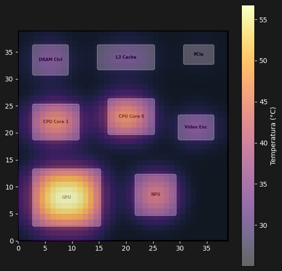

# Otimização  Térmica do Apple M3 utilizando Recozimento Simulado e Multi-Armed Bandit

<p align="justify">
Este projeto apresenta uma abordagem para otimização do posicionamento de blocos funcionais em um chip utilizando o algoritmo de <b>Recozimento Simulado</b> combinado com <b>Multi-Armed Bandit</b> baseado em <b>Amostragem de Thompson</b>. O objetivo é encontrar automaticamente uma disposição física que minimize a temperatura máxima do circuito, reduza regiões de maior aquecimento e elimine sobreposições entre os blocos.
</p>

<p align="justify">
Durante a otimização, diferentes estratégias de movimentação são avaliadas automaticamente pelo algoritmo de <b>Multi-Armed Bandit</b>, permitindo que o sistema aprenda quais ações produzem os melhores resultados térmicos ao longo das simulações. Ao final, é gerado um mapa de calor que representa a distribuição de temperatura do chip otimizado.
</p>

---

# 1. Objetivos

<p align="justify">

- Minimizar a temperatura máxima do chip.
- Reduzir regiões de maior aquecimento.
- Eliminar sobreposição entre blocos.
- Encontrar automaticamente uma disposição física eficiente.
- Comparar diferentes estratégias de movimentação.
- Demonstrar a aplicação de Inteligência Artificial na otimização térmica de chips.

</p>

---

# 2. Tecnologias Utilizadas

<p align="justify">

- Python
- NumPy
- Matplotlib
- SciPy
- Numba
- Recozimento Simulado
- Multi-Armed Bandit
- Amostragem de Thompson

</p>

---

# 3. Arquitetura

```text
        Definição dos Blocos
                 │
                 ▼
       Inicialização do Chip
                 │
                 ▼
      Recozimento Simulado
                 │
      Seleção da Estratégia
                 │
                 ▼
      Multi-Armed Bandit
                 │
                 ▼
      Simulação da Temperatura
                 │
                 ▼
      Avaliação da Função Custo
                 │
                 ▼
      Atualização da Estratégia
                 │
                 ▼
 Melhor Posicionamento Encontrado
                 │
                 ▼
      Geração do Mapa de Calor
```

---

# 4. Modelagem do Chip

<p align="justify">
Cada bloco funcional possui potência dissipada, largura e altura. Durante a otimização, todos os componentes podem ser reposicionados dentro da área do chip, respeitando seus limites físicos.
</p>

<p align="justify">
O modelo considera componentes como CPU, GPU, NPU, memória cache, controlador de memória, PCIe e codificador de vídeo.
</p>

---

# 5. Simulação Térmica

<p align="justify">
Cada bloco dissipa uma determinada quantidade de potência. Essa potência é utilizada para construir um mapa térmico bidimensional. Em seguida, aplica-se um filtro Gaussiano para representar a propagação do calor entre regiões vizinhas do chip, produzindo uma distribuição contínua de temperatura.
</p>

---

# 6. Função de Custo

<p align="justify">
A qualidade de cada solução é determinada por uma função de custo composta pelos seguintes fatores:
</p>

<p align="justify">

- Temperatura máxima do chip;
- Penalização por sobreposição entre blocos;
- Penalização térmica utilizada durante a otimização.

</p>

<p align="justify">
O algoritmo procura minimizar esse valor ao longo das iterações.
</p>

---

# 7. Recozimento Simulado

<p align="justify">
O Recozimento Simulado realiza pequenas movimentações aleatórias dos blocos. Soluções melhores são aceitas imediatamente, enquanto soluções piores ainda podem ser aceitas com determinada probabilidade durante as primeiras iterações, favorecendo uma exploração mais ampla do espaço de busca e reduzindo a chance de convergência para mínimos locais.
</p>

---

# 8. Multi-Armed Bandit

<p align="justify">
O projeto emprega Multi-Armed Bandit utilizando Amostragem de Thompson para selecionar automaticamente diferentes estratégias de movimentação. Cada estratégia recebe recompensas conforme a qualidade térmica obtida, permitindo que o algoritmo aprenda progressivamente quais decisões produzem melhores resultados.
</p>

---

# 9. Visualização

<p align="justify">
Ao final da otimização é produzido um mapa de calor contendo a posição dos blocos, a distribuição de temperatura e as regiões de maior aquecimento do chip.
</p>

---

# 10. Resultado Final

<p align="justify">
Mapa de calor para o chip otimizado. T_max: 56.8°C | T_min: 25.0°C
</p>

<br>

<p align="center">



</p>

---

# 11. Principais Características

<p align="justify">

- Posicionamento automático dos blocos.
- Simulação térmica bidimensional.
- Otimização baseada em Recozimento Simulado.
- Aprendizado adaptativo utilizando Multi-Armed Bandit.
- Geração automática do mapa de calor.
- Alto desempenho utilizando Numba.

</p>

---

# 12. Aplicações

<p align="justify">

- Projeto físico de circuitos integrados.
- Chips para Inteligência Artificial.
- Processadores multicore.
- Sistemas em chip (SoC).
- FPGA.
- Hardware embarcado.
- Pesquisa em Automação de Projeto Eletrônico (EDA).

</p>

---

# 13. Conclusão

<p align="justify">
Este projeto demonstra como técnicas de otimização e aprendizado podem ser combinadas para resolver problemas de posicionamento térmico em chips. Enquanto o Recozimento Simulado realiza uma busca eficiente no espaço de soluções, o Multi-Armed Bandit adapta continuamente a escolha das estratégias de movimentação com base no desempenho observado durante as simulações.
</p>

<p align="justify">
Como resultado, é possível obter disposições físicas capazes de reduzir a temperatura máxima do circuito, minimizar regiões de maior aquecimento e produzir soluções de alta qualidade de forma totalmente automática. A abordagem apresentada possui potencial de aplicação em ferramentas de projeto físico de circuitos integrados, contribuindo para o desenvolvimento de dispositivos eletrônicos mais eficientes, confiáveis e energeticamente sustentáveis.
</p>
````
